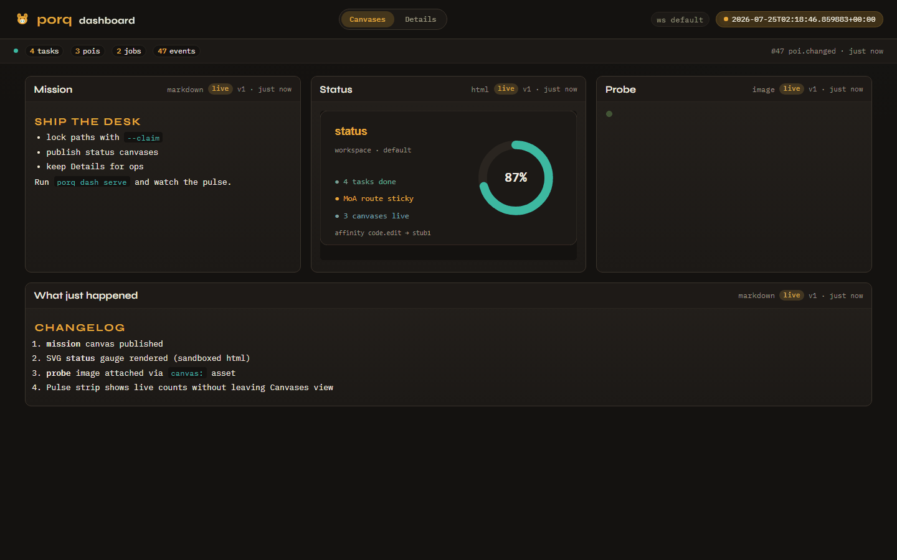
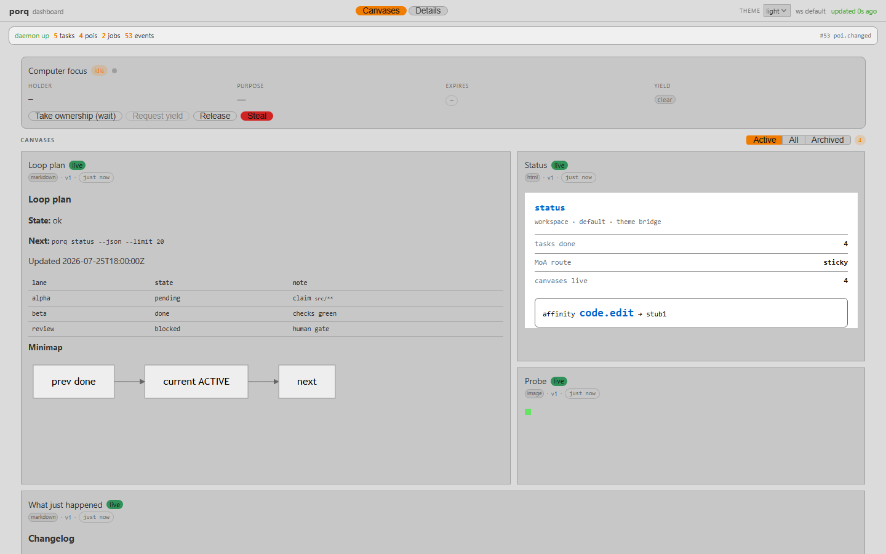
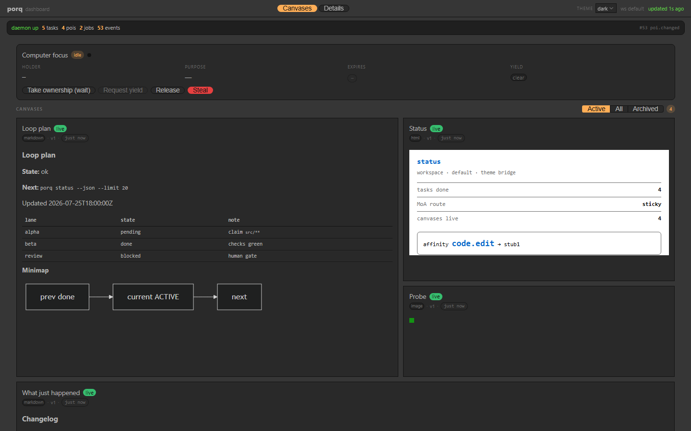
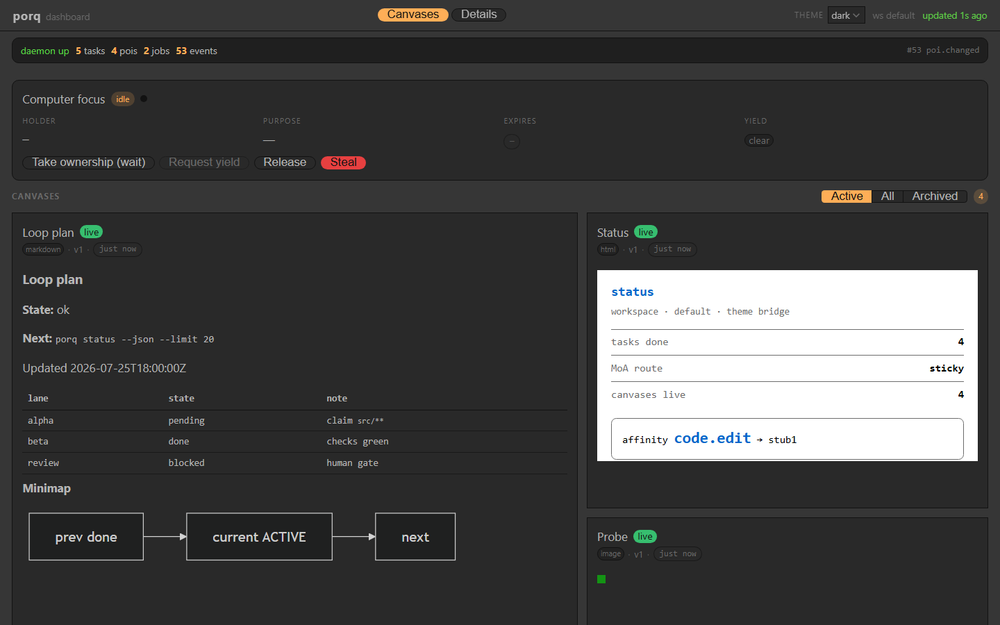
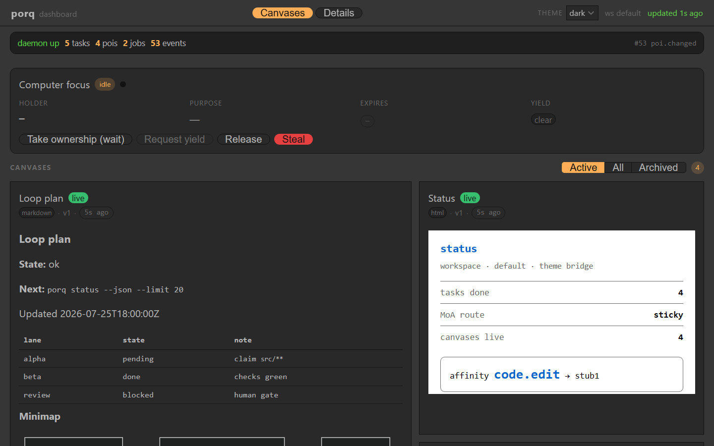

<p align="center">
  
</p>

# porq

> Progressive orchestration for multi-agent work.
> Pronounced like French *porc* — hence the pig. Agents that don’t collide.

A single local binary that grows with you. Start with supervised tasks; add
shared state, leases, triggers, model routing, and optional remote storage when
you need them. Earlier layers stay useful — you do not rewrite the workflow to
climb.

```text
run one task            →  porq run --sync -- "cargo test"
share state             →  + POIs (versioned JSON cells)
stop collisions         →  + leases & path claims
react to changes        →  + triggers & the daemon
route across models     →  + affinities, race / MoA jobs
share across machines   →  + --remote (Turso/libSQL)
```

<p align="center">
  
</p>

<p align="center"><sub><strong>Feature showcase</strong> — markdown (tables + status shape), <strong>mermaid</strong> fences, HTML with theme-bridge CSS vars, and image cards. Shell is Vue 3 + Ableton Extension SDK (<code>QaButton</code> / <code>QaBadge</code> / theme picker). Dark theme. <a href="https://qaaudio.github.io/porq/demo/"><strong>Live demo</strong></a> (observe-only) · <a href="docs/img/dashboard-details.png">Details view</a> · <a href="docs/img/gallery/theme-light.png">light theme</a></sub></p>

<p align="center">
  
</p>

<p align="center"><sub>Seeded demo GIF: <strong>Canvases</strong> ↔ <strong>Details</strong>. Regen with <code>cd web &amp;&amp; npm run capture:readme</code>.</sub></p>

---

## Why this exists

Multiple agents on one repo need coordination: versioned shared state, path
claims so editors do not collide, triggers for remediation, and a live view of
what actually ran. porq is that shared workspace — opt-in by layer, CLI-first.

You adopt `porq run` first. The rest is available when the workflow demands it.

---

## The layers

| Layer | You add | You get |
|-------|---------|---------|
| **0 — Run** | `porq run` | Supervised tasks: await, retry, cancel, kill, logs. No daemon needed with `--sync`. |
| **1 — Remember** | POI tables (+ `canvas`) | Versioned JSON cells (board cards, approvals, dashboard canvases). CAS, tiers, sessions. |
| **2 — Not collide** | Leases & claims | Time-boxed locks with holders; `--claim "src/**"` fences files for a task's lifetime. |
| **3 — React** | Triggers | "When X happens, do Y" with blocking vetoes, budgets, cascade guards. Daemon auto-spawns. |
| **4 — Route** | Models & jobs | Affinity scores that learn (EMA), `single` / `race` / `moa` scheduling. |
| **5 — Share** | `--remote` | Same CLI against Turso/libSQL. Shared store across machines, transactional writes. |

Every mutation lands in one append-only **event log**. The **dashboard** renders
tasks, POIs, jobs, and agent-published **canvases** (markdown / image / url /
html) from that store.

Related ideas: Pueue, Temporal, Restate, Taskwarrior, Hatchet.

### Showcase

Feature stills (`dashboard.png` / GIF / theme+scale gallery) come from
`cd web && npm run capture:readme`. A real consumer board (leases, checks,
review veto, human-gated roadmap — domain scripts stay outside porq core):

- **[Live demo](https://qaaudio.github.io/porq/demo/)** — real dashboard UI + frozen `tdrs-loop` snapshot (observe-only)
- [td-rs autonomous loop](docs/usecases/td-rs-autonomous-loop.md)
- Consumer screenshots: [`docs/img/usecases/`](docs/img/usecases/) ([Canvases](docs/img/usecases/porq-demo-canvases.png) · [Details](docs/img/usecases/porq-demo-details.png))

Regen the Pages payload after UI or fixture changes:

```bash
cargo build --release -p orq
cd web && npm run publish:demo
```

That copies [`web/dashboard/dist/`](web/dashboard/dist/) into [`docs/demo/`](docs/demo/) and writes a deterministic `data.json`. GitHub Pages must serve **`/docs`** from `main` (one-time repo setting).
---

## Install

```bash
git clone git@github.com:QaAudio/porq.git
cd porq
cargo build --release
# binary: target/release/porq
```

Optional: set `ORQ_DATA_DIR` (defaults to your platform's local data dir `/orq`).
Env vars keep the `ORQ_*` prefix for compatibility; Rust crate paths remain `orq` / `orq-core` for now.

Smoke everything once:

```bash
# Windows
powershell -ExecutionPolicy Bypass -File scripts/smoke.ps1
# Unix
./scripts/smoke.sh
```

---

## Quickstarts, one per layer

Expand and copy. Longer patterns live under
[Workflows](#workflows) and [`recipes/`](recipes/).

<details>
<summary><strong>Layer 0 — Run a task</strong></summary>

```bash
porq init
porq run --sync --name hi -- "echo hello from porq"
porq status --json
```

`--sync` blocks and supervises inline. Without it, a local daemon takes over.

</details>

<details>
<summary><strong>Layer 1 — Shared state (POIs)</strong></summary>

```bash
porq poi table create notes --cols body:string:poi
porq poi set notes hello '"world"' --tier ephemeral
porq poi get notes hello --json
```

Every `set` bumps a version; `--if-version` is compare-and-swap.

</details>

<details>
<summary><strong>Layer 2 — Leases and path claims</strong></summary>

```bash
porq poi lock notes hello --holder agent-a --ttl 300
porq poi lock notes hello --holder agent-b --wait --timeout-ms 120000
porq run --sync --name refactor --claim "src/**" -- "cargo test -p foo"
```

`--wait` polls until the lease is free (or `--timeout-ms` elapses). Without it, `LockHeld` fails immediately.
Overlapping claims wait or fail closed. Use `poi steal` for recovery.

</details>

<details>
<summary><strong>Layer 3 — Triggers</strong></summary>

```bash
porq trigger add on-broken --on poi.changed --where-cond "state==broken" --do-action "spawn:./remediate.sh"
```

Blocking triggers can veto; budgets and cascade guards limit runaway remediations.

</details>

<details>
<summary><strong>Layer 4 — Model routing / MoA</strong></summary>

```bash
porq model add fast --cli "echo FAST:{cmd}" --capability code
porq model add strong --cli "echo STRONG:{cmd}" --capability code
porq affinity set code.edit strong --score 0.9
porq run --sync --class code.edit --strategy moa --moa-k 2 --name edit -- "propose"
```

Affinities learn from outcomes (EMA). `race` returns the first good answer;
`moa` proposes then aggregates.

</details>

<details>
<summary><strong>Layer 5 — Remote store (Turso/libSQL)</strong></summary>

```bash
cp .env.example .env   # fill ORQ_DB_URL + TOKEN
porq --remote init
porq --remote poi set board hello '{"msg":"shared"}'
```

Opt-in only: without `--remote`, storage stays local. A present `.env` does not
force remote mode.

</details>

<details>
<summary><strong>Publish a canvas</strong></summary>

```bash
porq canvas set plan --body "## Next\n- probe\n- ship"
porq canvas set shot --image ./out.png --title "Render"
porq dash serve --port 9847
```

Canvases are POIs in the reserved `canvas` table — versioned, lockable, refreshed within about 1s.

</details>

<details>
<summary><strong>Open the dashboard</strong></summary>

```bash
porq dash snapshot
porq dash serve --port 9847
# → http://127.0.0.1:9847/
```

</details>

<details>
<summary><strong>Integrate with Cursor</strong></summary>

```bash
porq integrate cursor --path /path/to/host/repo
```

Writes `.cursor/skills/porq/SKILL.md` and an `AGENTS.md` snippet so agents use
POI / claim / trigger / canvas instead of ad-hoc lock files.

</details>

---

## Workflows

Composed from the layers above — no extra product surface required.

### Multi-agent coding workspace (layers 1–3)

Several Cursor / CLI agents share one workspace.

1. A `board` POI table holds tickets (`todo` → `doing` → `done`).
2. Each agent **locks** a card (`porq poi lock board T-12 --holder agent-a`).
3. Tasks **claim** the paths they will touch.
4. A trigger cancels stale work when a card flips to `blocked`.
5. Dashboard on a second monitor for operators.

### Human-in-the-loop gates (layers 1 + 3)

POIs as approval tokens:

```text
agent finishes PR  →  sets poi reviews/pr-42 = {ready:true}
human flips blocked → false
trigger unblocks   →  merge / deploy task runs
```

See `review-gate` and `preland-gate` in [`recipes/`](recipes/).

### Single-committer lane (layer 2)

One process holds the git write lease on `paths/repo`; others queue proposed
patches as POIs. A committer task drains, commits, and releases.

### External tracker sync (layers 1 + 0)

A durable POI table mirrors tickets; a **service** task polls and CAS-writes.
Agents talk to porq; the syncer talks to the tracker.

### Pre-land verification (layer 3)

`preland-gate`: spawn parallel check tasks; a **blocking** trigger vetoes land
if any fail. Budgets cap remediations.

### Model selection (layer 4)

Register model recipes (CLI wrappers or API scripts). Affinity EMA learns which
model wins for `code.edit` vs `docs.summarize`.

### Local then shared (layer 5)

Prototype on SQLite. When you need one store across machines, copy
`.env.example` → `.env`, pass `--remote`, keep the same commands. Transactions
cover poi+event, leases, and jobs.

---

## Recipes

Executable patterns in [`recipes/`](recipes/):

| Recipe | Purpose |
|--------|---------|
| `linear-sync` | Bidirectional roadmap via CAS + poller |
| `central-committer` | Serialized git writes |
| `computer-focus` | Exclusive desktop capture / focus lease |
| `review-gate` | Human approval unblocks a task |
| `preland-gate` | Fan-out verify + blocking veto |
| `queue-drain` | Parallel drain, single-flight apply |
| `model-routing` | Affinity picks a model |
| `moa-merge` | Mixture-of-Agents propose + aggregate |

---

## Live dashboard

Vue 3 + `@quantumaudio/ableton-extension-sdk` UI — sources in [`web/src/`](web/src/), build output in [`web/dashboard/dist/`](web/dashboard/dist/) (served by `dash serve`).

- **Shell** — SDK primitives (`QaPanel`, `QaButton`, `QaBadge`, `QaSegmented`, `QaSelect`, `QaLed`). Canvas bodies never inject Vue/SDK components.
- **Markdown canvases** — escape-first subset (headings, tables, lists, bold/code) plus fenced **`mermaid`** blocks (client-side, `securityLevel: 'strict'`, theme-inherited).
- **HTML canvases** — sandboxed `srcdoc`; prefer theme-bridge CSS vars (`--text`, `--muted`, `--accent`, `--bg`, `--panel`, `--border`) — see [`docs/canvas-authoring.md`](docs/canvas-authoring.md).
- **Layout** — Canvases sit on a **12-col grid** (`porq.dash.layout.canvases`); Details uses a resizable **dock** (`porq.dash.layout.dock`). Both are browser-local only.
- **Filter** — Active / All / Archived (`porq.dash.filter.state`) applies to Canvases + Board.

**Public observe-only demo:** [qaaudio.github.io/porq/demo/](https://qaaudio.github.io/porq/demo/) — same UI as local dash, frozen `tdrs-loop` snapshot (`static_demo`). Computer-focus Claim/Wait/Release are disabled there. Regenerate with `cd web && npm run publish:demo`.

```bash
cd web && npm run build                # → dashboard/dist
porq dash snapshot                     # → $ORQ_DATA_DIR/dash/data.json
porq dash serve --port 9847            # dist UI + /data.json (1s refresh)
```

Override static root with `--root` or `ORQ_DASH_ROOT` (defaults to `web/dashboard/dist`).

Scoped mutate (localhost only): `POST /api/v1/poi/{lock,unlock,steal,yield-request}`
for **`computer/focus`** — powers the Canvases **Computer focus** Claim/Wait/Release UI.
Roadmap / git / other POIs stay CLI-only.

### Themes (opt-in)

SDK `data-qa-theme`: **dark** (default) or **light**. Aliases: `default`/`dracula` → dark, `system` → light.

- CLI: `porq dash serve --theme light` or `--theme-file ./extra.css` (served as `/themes/custom.css`)
- Env: `ORQ_DASH_THEME` / `ORQ_DASH_THEME_FILE`
- Header picker persists `porq.dash.qa-theme`

See [`web/dashboard/themes/README.md`](web/dashboard/themes/README.md).

#### Theme gallery

<table>
  <tr>
    <td align="center" width="50%">
      <a href="docs/img/gallery/theme-dark.png"></a><br />
      <sub><b>dark</b></sub>
    </td>
    <td align="center" width="50%">
      <a href="docs/img/gallery/theme-light.png"></a><br />
      <sub><b>light</b></sub>
    </td>
  </tr>
</table>

#### UI scale gallery

Same Canvases board at browser zoom **100% / 125% / 150%** (useful when checking density on HiDPI desks).

<table>
  <tr>
    <td align="center" width="33%">
      <a href="docs/img/gallery/scale-100.png"></a><br />
      <sub><b>100%</b></sub>
    </td>
    <td align="center" width="33%">
      <a href="docs/img/gallery/scale-125.png"></a><br />
      <sub><b>125%</b></sub>
    </td>
    <td align="center" width="33%">
      <a href="docs/img/gallery/scale-150.png"></a><br />
      <sub><b>150%</b></sub>
    </td>
  </tr>
</table>

Full-size stills live under [`docs/img/gallery/`](docs/img/gallery/). Regen with `cd web && npm run capture:readme`.

### Two views

- **Canvases** (primary, default) — agent-published markdown / image / url / html cards on the 12-col grid, plus the **Computer focus** ownership panel.
- **Details** — docked board, tasks, jobs, affinities, events, files. Opens automatically when there are no canvases.
- **Pulse strip** — counts + latest event; click to open Details.

Tab choice persists in `localStorage`. Regenerate README images with
`cd web && npm run capture:readme` (hero PNGs/GIF + theme/scale gallery).

### Canvases (display protocol v1)

Agents publish display surfaces as POIs in the reserved **`canvas`** table.
The dashboard polls them with the rest of the snapshot.

| `kind` | Fields | Renders as |
|--------|--------|------------|
| `markdown` | `title`, `body` | Safe escape-first markdown subset (+ optional `mermaid` fences) |
| `image` | `title`, `src`, `alt?` | `` |
| `url` | `title`, `src`, `height?` | Sandboxed iframe |
| `html` | `title`, `body`, `height?` | `srcdoc` iframe (`sandbox=""` — no scripts) |
| *(other)* | any | Pretty-printed JSON fallback |

`src` forms: `data:…` (inline), `canvas:<file>` → `$ORQ_DATA_DIR/canvas/` via
`GET /canvas/<file>`, or `http(s)://…`. Layout hints: `columns.order`,
`columns.span` (`1`|`2`). State: `live` / `done` / `archived`.

```bash
porq canvas set plan --md ./notes.md --order 1
porq canvas set shot --image ./frame.png --span 2
porq canvas set report --url https://example.com/status --height 480
porq canvas ls --json
porq canvas rm plan
```

### Dashboard E2E

```bash
cargo build -p orq
cd web && npm ci && npx playwright install chromium
npm run test:e2e
```

Seed data is CLI-only (`echo` stubs): board POIs, affinities, a routed task,
one MoA job.

---

## Storage backends

One store API (`crates/orq-core/src/db.rs`), two backends.

| Mode | Backend | How you get it |
|------|---------|----------------|
| **Local** (default) | SQLite file `<data_dir>/orq.db` | just run `porq` |
| **Remote** | Turso / any libSQL over HTTP | `porq --remote` + `ORQ_DB_URL` / `ORQ_DB_TOKEN` |

```bash
# .env (gitignored) — see .env.example
ORQ_DB_URL=libsql://YOUR_DB.turso.io
ORQ_DB_TOKEN=YOUR_TOKEN_HERE

porq --remote init
porq --remote workspace drop old-ws --yes   # destructive
```

- Multi-statement mutations run in one transaction (`BEGIN IMMEDIATE` locally).
- Live Turso E2E: `cargo test -p orq-core --test turso_e2e` (skips if no creds).
- Embedded replica (local reads, synced writes) is planned.
- Lease expiry uses client clocks — keep clocks reasonably synced for remote multi-writer setups.

---

## Mental model

```text
┌──────────── workspace ────────────┐
│  POIs (versioned cells + leases)  │
│  Tasks (claims, logs, await)      │
│  Triggers (react + budgets)       │
│  Jobs / models (route & learn)    │
│  Events (append-only log)         │
└───────────────────────────────────┘
         │
         ├── local SQLite
         └── optional Turso / libSQL
```

- Daemon-optional: `porq run --sync` needs none; unsupervised `run` auto-spawns
  `porq daemon run` (localhost TCP + port file).
- Every mutation emits an event.
- Locks are **leases** (TTL + holder). Use `poi steal` for recovery.
- Claims (`--claim "src/**"`) are write leases on the `paths` table for the task lifetime.
- Nothing above layer 0 is required.

---

## License

MIT. Contributions welcome.
