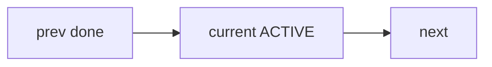

# Canvas authoring (dashboard cards)

Short guide for agents publishing `porq canvas set` markdown/html so operators can skim without dumping logs.

**Chrome vs content:** The dashboard shell is Vue 3 + `@quantumaudio/ableton-extension-sdk`. Canvas **bodies** remain markdown/image/url/html POIs — do not embed Vue SFCs or SDK components inside `canvas set` content.

## Shape (every live card)

1. **H1** — what this surface is (one line).
2. **State word** — one of: `live`, `ok`, `warn`, `blocked`, `failed`, `done`, `waiting`, `archived` (match host vocabulary when present). Prefer `archived` for retired cards (dash hides them under Active filter by default).
3. **Next command** — the single cheapest CLI/action an operator or agent should run next.
4. **Freshness** — write an absolute UTC clock once at publish (`**Generated:**` or `Updated` + ISO-8601 `…Z`). Do **not** invent relative ages (`3m ago`) in the body — the dash upgrades those ISO tokens to clickable TimeBadges (default **relative**) and the card chrome already shows live age from POI `updated_at`. Header `#stamp` is poll freshness only.

Example:

```markdown
# Loop health

**State:** ok

**Next:** `porq status --json --limit 20`

**Generated:** 2026-07-25T16:02:00Z
```

## Prefer tables over dumps

- Summarize POIs/tasks as markdown tables (id | state | note).
- Do not paste unbounded JSON, full event logs, or multi-KB stderr into the body.
- Link to a file or say which `porq … --limit` command reveals detail.

## Mermaid diagrams

Markdown canvases may include fenced `mermaid` blocks (language tag `mermaid` on a standard code fence). The dash lazy-loads Mermaid and renders them client-side with `securityLevel: 'strict'` (fence text is still escaped before paint).

Example body fragment:

~~~~markdown
## Minimap


~~~~

Keep diagrams small (a handful of nodes). Do not use Mermaid `style` / `classDef` hex colors — inherit theme. There is no separate `--mermaid` canvas kind; use `--md` / `--body`.

## Theme inheritance (SDK bridge)

The live dash uses SDK theme tokens (`data-qa-theme="dark|light"`). HTML canvases should use **bridge aliases** (mapped in dash layout CSS) so cards stay readable in both themes:

| Prefer in HTML canvas | Resolves to |
|-----------------------|-------------|
| `var(--text)` | SDK `--c-text-primary` |
| `var(--muted)` | SDK `--c-text-secondary` |
| `var(--accent)` | SDK `--c-accent` |
| `var(--bg)` / `var(--panel)` | SDK surface tokens |
| `var(--border)` | SDK `--c-control-border` |

**No hardcoded hex** for chrome colors. Markdown cards are theme-neutral text; avoid inline color styles.

Optional `--theme-file` still serves `/themes/custom.css` for extra overrides.

## Status vocabulary

Use plain status words operators already understand (`ok` / `warn` / `blocked` / `failed` / `archived`). Do not invent host-specific gate law inside a generic canvas; host Loop Meta cards own veto semantics.

## Cheap surfaces first

Before publishing a heavy canvas, check whether `porq status`, `poi ls`, or `events --limit` already answers the claim. Canvases are for **shared glance**, not a substitute for bounded CLI probes.
