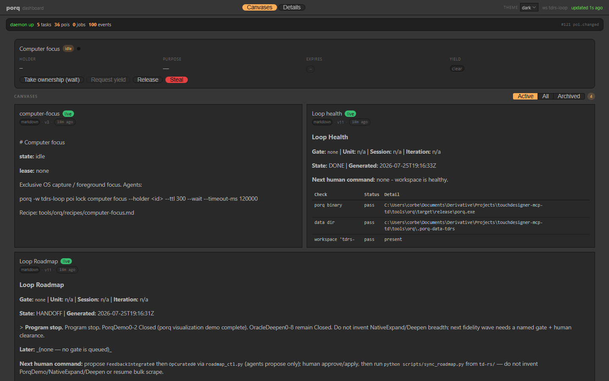

# Use case — td-rs autonomous loop on porq

> One sentence: **porq coordinates a Rust TouchDesigner-clone autonomous loop**
> with leases, claimed exec, a check matrix, review land-veto, drift handoff,
> and human-gated roadmap proposals — without becoming a TD-domain engine.

This page is evidence that porq’s generic layers (run → POI → lease → trigger →
dashboard) bend to a real consumer. Loop Meta policy, roadmap law, and TDIV
registry live in **td-rs**; porq stores opaque POIs, runs tasks, and paints
canvases.

Screenshots / GIF: [`../img/usecases/`](../img/usecases/)



_Canvases view on `:9847` (`tdrs-loop`) after PorqDemo0–2 — health, roadmap, checks, review._

## Architecture sketch

```text
Human SoT: STATE.json · queues · INTENTIONAL_DIVERGENCE registry
                │ read-only mirror
                ▼
        porq workspace tdrs-loop
   roadmap · gate-locks · reports · reviews
   drift-reports · roadmap-proposals · canvas
                │
   Loop Meta agent ── lock / claim / run / record ──► porq
   review trigger ── task.pre-exec veto on land-* ──► blocked|ok
                │
                ▼
        porq dash serve :9847   (observe)
        CLI / harness           (control)
```

| Loop Meta phase | Porq primitive (generic name) |
|-----------------|-------------------------------|
| MAsk / preflight | POI + canvas (`loop-preflight`) |
| MClassify | `drift-reports` POI + `loop-drift` |
| MSched | lease on `gate-locks/<gate>` |
| MExec | `run --sync` + path claims |
| MVerify | named check tasks → `loop-checks` |
| MLand gate | blocking `task.pre-exec` on `land-*` |
| Roadmap change | proposal POI; **human receipt** before harness apply |

## Walkthrough (accurate — no fake Active gate)

Today’s td-rs program stop is **`Active: none`**. That is a valid handoff, not
a bug. The demo below stays on scratch mirrors and display canvases; it does
**not** auto-promote a Later gate.

1. **Program-stop mirror** — `sync_roadmap_to_porq` paints `loop-roadmap` with
   `HANDOFF` / gate `none`. Preflight may report `not-ready`; do not invent work.
2. **Preflight canvas** — budget math + readiness on `loop-preflight`.
3. **Claimed exec** — a scratch unit runs as
   `porq run --sync --name exec-<gate>-<unit> --claim "…" -- <cmd>` while
   holding `gate-locks/<gate>`.
4. **Check matrix** — named check tasks publish `loop-checks` (green path and
   forced-red path in dry-runs).
5. **Review land veto** — `land-*` never starts when review/check POIs are
   missing or red (`task.pre-exec` hook).
6. **Drift / TDIV handoff** — classify before parity mutation; proposed
   intentional divergence waits for a human — agents do not approve TDIV.
7. **Proposal + out-of-band approval** — `roadmap_ctl.py propose` → human
   receipt → `apply`. Porq canvases show status; they are not credentials.

## Steal these patterns

Without cloning td-rs, reuse the orchestration surface:

| Pattern | Where in porq |
|---------|----------------|
| Pre-land veto | `recipes/preland-gate` + blocking `task.pre-exec` |
| Exec review spawn | `recipes/review-agent` (supervised `run` fallback) |
| Structured agent launch | Launch profiles / result envelopes (`docs/adapters.md`) |
| Observe ≠ control | Dashboard read-only; CLI mutates |
| Path single-flight | `--claim` + separate lock namespace from display POIs |

## Vision guard

If a change only helps Loop Meta / Cursor / TD vocabulary, keep it in the
td-rs integration layer. porq core stays provider-agnostic: tasks, events,
POIs, leases, triggers, launch profiles — not roadmap verbs or TDIV schema.
