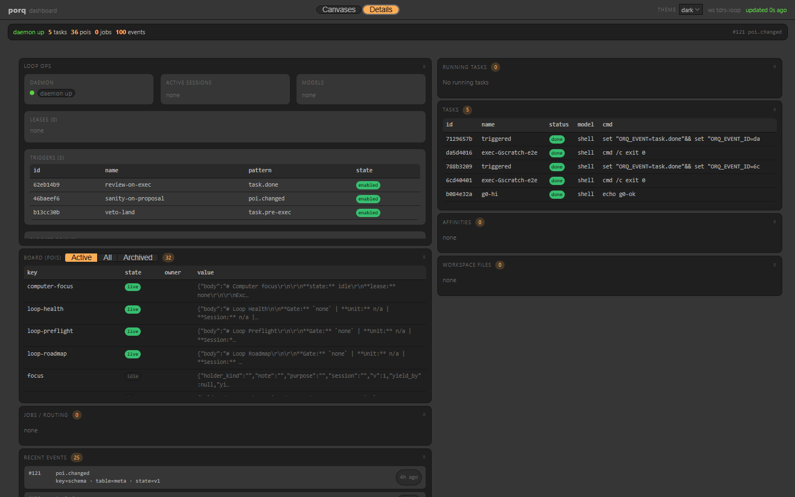

# Use case — td-rs autonomous loop on porq

> **porq coordinates a Rust TouchDesigner-clone autonomous loop** with leases,
> claimed exec, a check matrix, review land-veto, and human-gated roadmap
> proposals — without becoming a TD-domain engine.

This page is evidence that porq’s generic layers (`run` → POI → lease → trigger →
dashboard) bend to a real consumer. Loop Meta policy and roadmap law live in
**td-rs**; porq stores opaque POIs, runs tasks, and paints canvases.

## Watch this board

**Public (observe-only):** [https://qaaudio.github.io/porq/demo/](https://qaaudio.github.io/porq/demo/) — real porq dashboard UI with a frozen `tdrs-loop` snapshot (no mutate). Regenerate locally with `cd web && npm run publish:demo`.

**Local (live store):** after bootstrap, the same story on
[`porq -w tdrs-loop dash serve --port 9847`](http://127.0.0.1:9847/).


_Canvases view._ Health is green, roadmap is on **HANDOFF** (`Active: none`),
checks passed, and a **red** review shows the land-veto path working — observe
first, CLI controls.



_Details view._ Same live pulse strip; board/tasks/events for correlation when a
canvas says “blocked” and you need the task id.
## How the story maps to primitives

```text
Human SoT: STATE.json · queues · intentional-divergence registry
                │ read-only mirror
                ▼
        porq workspace tdrs-loop
   roadmap · gate-locks · reports · reviews · canvas
                │
   Loop Meta agent ── lock / claim / run / record ──► porq
   review / checks ── task.pre-exec veto on land-* ──► blocked|ok
                │
                ▼
        porq dash :9847   (observe)
        CLI / harness     (control)
```

| What you see on the board | Porq primitive |
|---------------------------|----------------|
| `loop-preflight` / health | POI + canvas |
| Gate lease / session | `gate-locks/<gate>` |
| Exec unit | `run --sync` + `--claim` |
| Check matrix | named tasks → `loop-checks` |
| Red review blocking land | blocking `task.pre-exec` on `land-*` |
| Roadmap proposal status | display POI — **human receipt** applies |

## Short walkthrough (no fake Active gate)

1. **Program-stop mirror** — `sync_roadmap_to_porq` paints `loop-roadmap` with gate
   `none`. Preflight may be `not-ready`; that is expected.
2. **Claimed exec** — scratch unit as `porq run --sync --name exec-… --claim …`.
3. **Checks + review** — green checks and a forced-red review prove land never
   starts when the veto fires (`loop_scratch_e2e.ps1`).
4. **Human roadmap** — `roadmap_ctl.py propose` → out-of-band receipt → `apply`.
   Canvases show status; they are not credentials.

## Steal these patterns

| Pattern | Where in porq |
|---------|----------------|
| Pre-land veto | `recipes/preland-gate` + blocking `task.pre-exec` |
| Exec review | `recipes/review-agent` (supervised `run` fallback) |
| Structured agent launch | Launch profiles (`docs/adapters.md`) |
| Observe ≠ control | Dashboard read-only; CLI mutates |
| Path single-flight | `--claim` + lock namespace separate from display POIs |

## Vision guard

Domain scripts stay in `td-rs/`. This usecase proves porq’s flexibility — it is
not a reason to hardcode Loop Meta into porq core.
