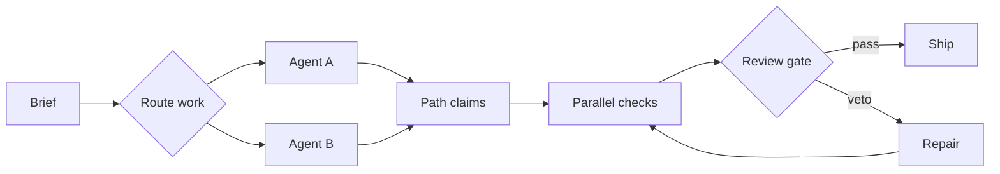

# From prompt to verified change

**State:** live

**Next:** `porq status --json --limit 20`

**Generated:** 2026-07-25T20:00:00Z

The diagram is rendered client-side from a fenced Mermaid block. It inherits
the dashboard theme and runs with Mermaid's strict security mode.
